GAN-Based Video Generation of Human Action by Using Two Frames
==========

A PyTorch implementation of "GAN-Based Video Generation of Human Action by Using Two Frames" 

Dataset Preparation
----------
1. To reproduce our results, download the [Huamn 3.6M dataset](https://vision.imar.ro/human3.6m/main_login.php).
2. Resize the videos into 256*256, and save all the videos in a single folder named Videos_"action"_256
3. Use the [Real-Time Multi-Person 2D Pose Estimation Using Part Affinity fields](https://github.com/ZheC/Realtime_Multi-Person_Pose_Estimation) pre-train model to extract the 15 human joint points, and save all the videos in a single folder named Pose_D2_256_"action".

Demo
----------
Download [pre-train pytorch models](https://drive.google.com/drive/folders/1e57BfOmdBrufcy5au5FwqrkJ07KoWaJ0?usp=sharing)
Training
----------

Performance Evaluation
----------

Visual Results Comparing
----------

### Sitting
Ours

  
  
  
  

[1] 
 

  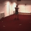
  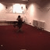
  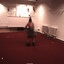
  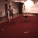

### Walking
Ours

  
  
  
  

[1] 
 

  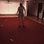
  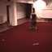
  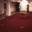
  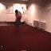

### Sitting Down
Ours

  
  
  
  

[1] 
 

  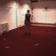
  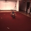
  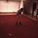
  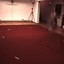

